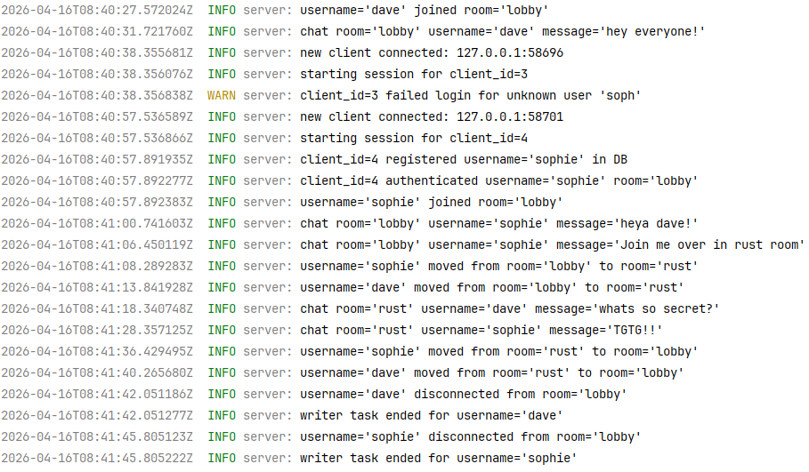
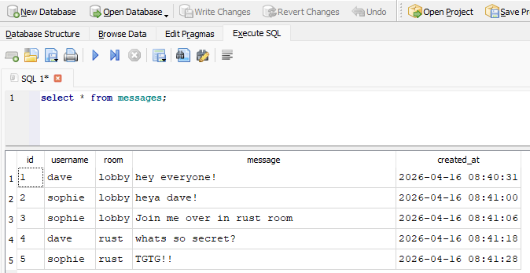
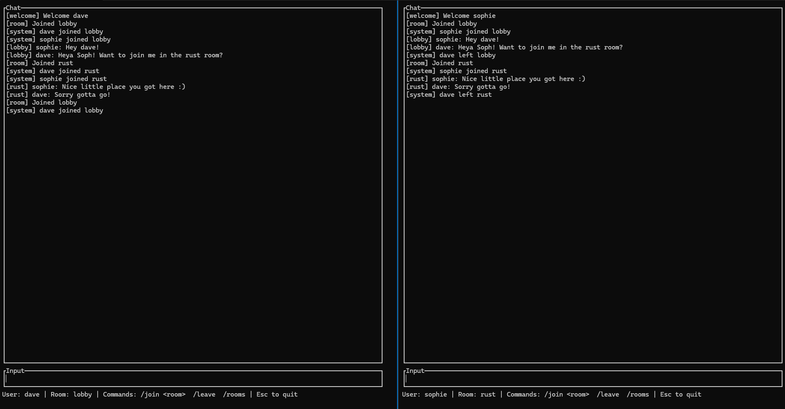

# RatRoom V3 — Async Chat Server with Auth, DB & Logging

A production-style multi-client chat application built in Rust using async networking, authentication, SQLite persistence, and structured logging.

This project is the final evolution of the RatRoom series, focusing on real-world backend concepts such as authentication, database integration, and modular architecture.

---

## Features

- Async multi-client chat server using Tokio  
- Room-based messaging system  
- User registration and login  
- Secure password hashing with Argon2  
- SQLite database for user accounts and messages  
- Message persistence with timestamps  
- JSON-based client/server protocol  
- Terminal UI client built with Ratatui  
- Structured logging with tracing  
- Modular project architecture (server/client/state separation)

---

## Topics covered

- How to build an async TCP server in Rust  
- Designing a client-server protocol using JSON  
- Implementing authentication flows (register/login)  
- Secure password storage using hashing (Argon2)  
- Integrating SQLite with `sqlx`  
- Structuring a real-world Rust project using modules  
- Managing shared state safely with `Arc<Mutex<...>>`  
- Building a terminal UI with Ratatui  
- Logging and debugging with `tracing`

---

## Project Structure

```
src/
  client/
    app.rs        # App state
    commands.rs   # Command parsing (/join, /leave, etc.)
    network.rs    # Sending messages to server
    ui.rs         # Terminal UI rendering
    mod.rs

  server/
    client_handler.rs  # Core client logic
    state.rs           # Database operations (users/messages)
    mod.rs

  shared/
    protocol.rs  # Shared message types (client/server)

  client_main.rs  # Client entry point
  server_main.rs  # Server entry point
```

---

## Configuration

### server.toml

```toml
host = "0.0.0.0"
port = 8080
```

### client.toml

```toml
host = "127.0.0.1"
port = 8080
```

---

## Running the Application

### Start the server

```bash
cargo run --bin server
```

### Start the client

```bash
cargo run --bin client
```

---

## Authentication Flow

When the client starts:

1. Choose:
   - `register` to create a new account  
   - `login` to sign in with existing credentials  

2. Enter username and password  

3. On success:
   - You join the default room (`lobby`)
   - Chat begins immediately  

---

## Commands

Inside the chat client:

```
/join <room>   Join or create a room
/leave         Return to lobby
/rooms         List active rooms
Esc            Exit client
```

---

## Database

SQLite database (`chat.db`) is created automatically.

### Tables

#### users
- username (primary key)
- password (hashed with Argon2)

#### messages
- id
- username
- room
- message
- created_at

---

## Screenshot





---

## Previous Versions

- V1 — Threaded chat server  
- V2 — Async chat server  
- V3 — Auth, DB, logging, modular architecture  

---

## Future Improvements

- Load recent message history on room join  
- Private messaging  
- Web-based frontend  
- Deployment to cloud (AWS/Docker)  
- Rate limiting / spam protection  

---

